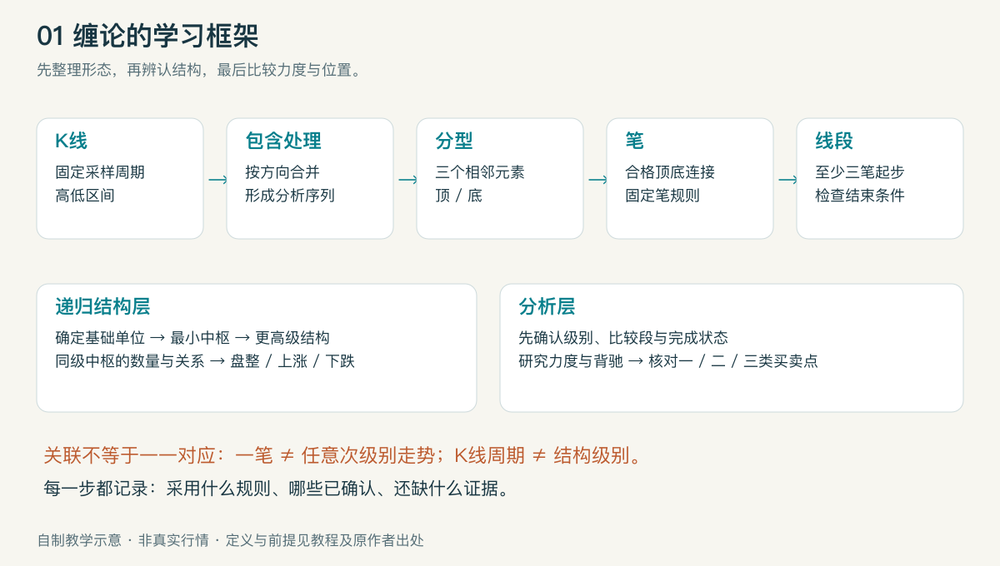
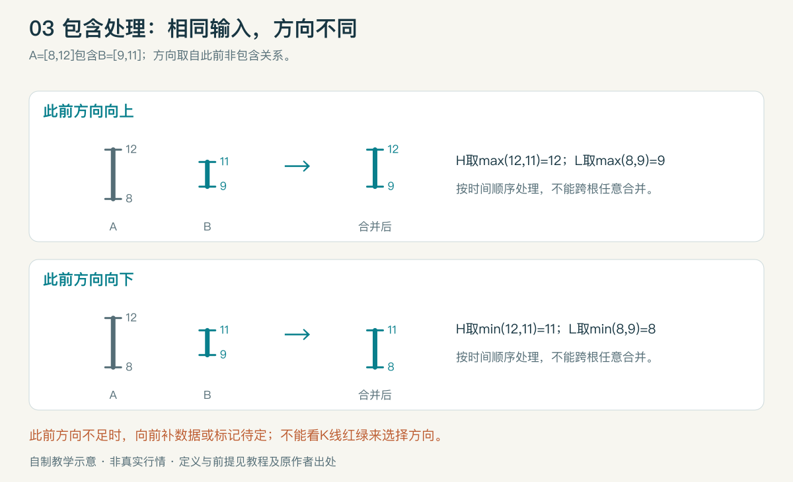
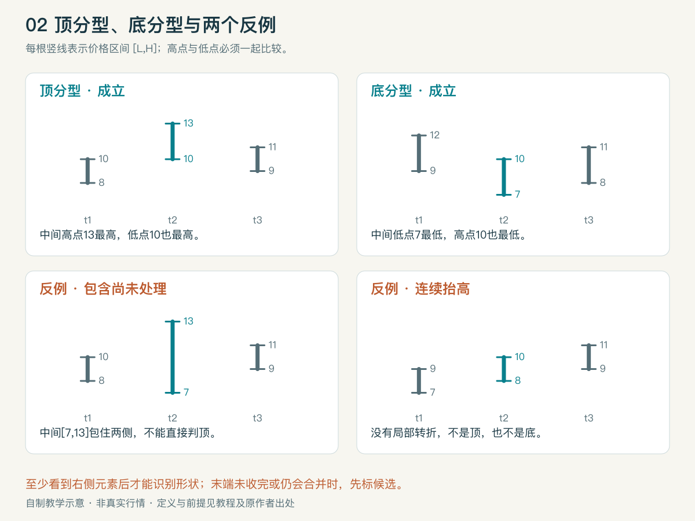
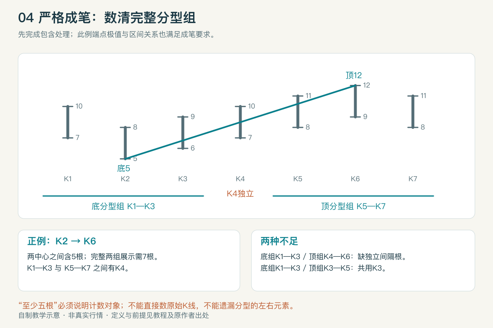
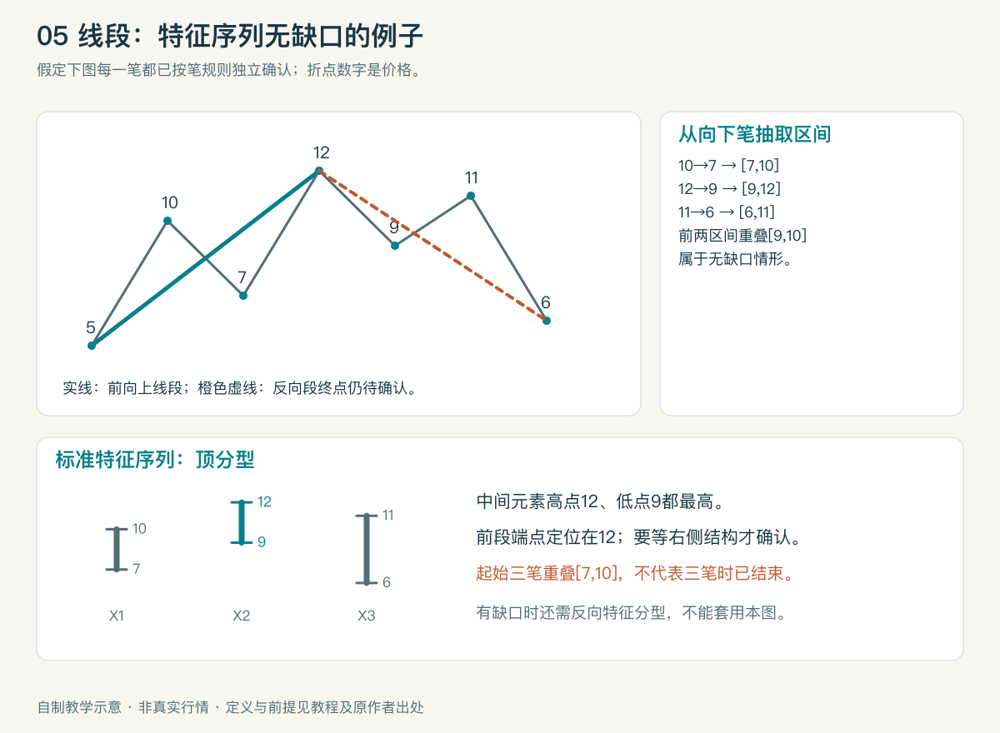
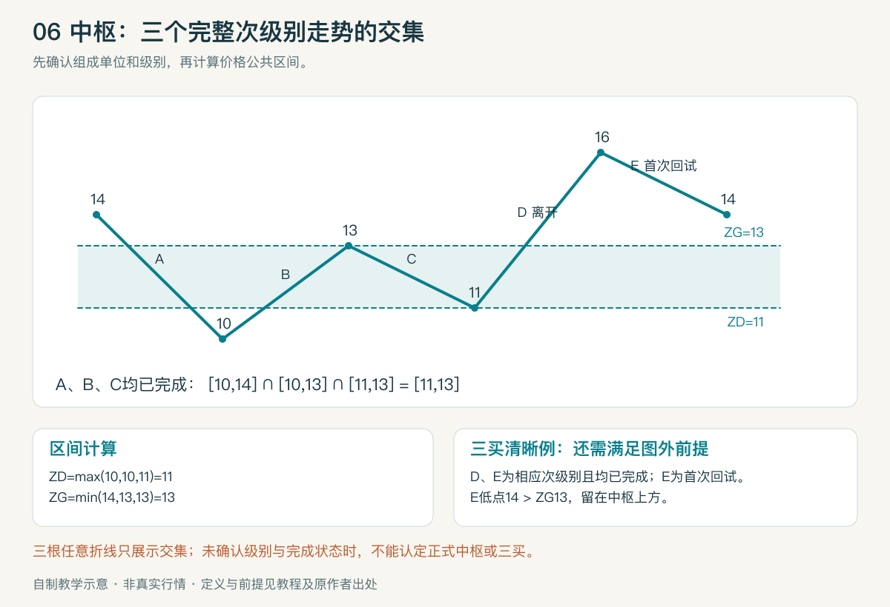
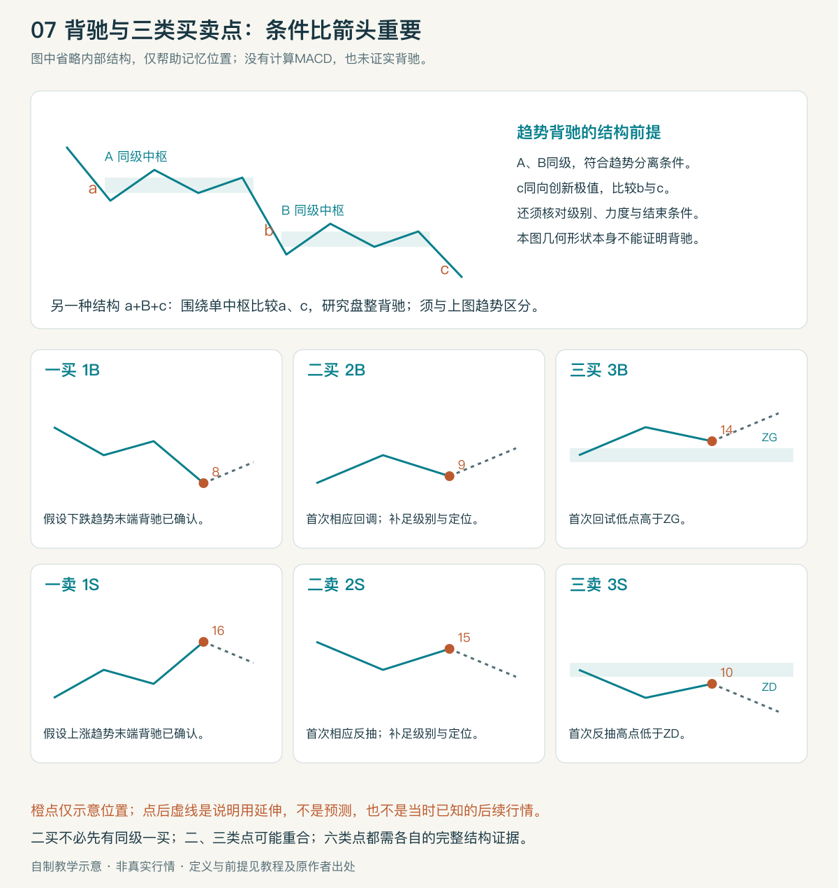

# 缠论框架基础教程

适合零基础读者｜v1.0｜2026-09-20｜[术语映射表](glossary.md)｜[来源](sources.md)

## 1. 先看整体：它试图描述什么

可以把学习任务分成三层：**先整理价格形状，再辨认结构，最后比较力度与位置**。这是一种教学组织方式，不是原文中的新定理。

下层的分型、笔、线段帮助整理图形；中枢、走势类型与级别构成另一套递归结构。二者有关联，但不能机械地写成“一笔等于一个小级别走势、一段等于一个大级别走势”。实践中选定基础观察尺度，再用线段建立最小中枢结构，之后递归组合。[第63课](https://blog.sina.com.cn/s/blog_486e105c01000bgd.html)、[第83课](https://blog.sina.com.cn/s/blog_486e105c01000cqy.html)

初学时只回答四个问题：现在看到什么结构？按什么规则划分？已经确定什么？还缺什么后续信息？不要一开始就猜下一根K线涨跌。

## 2. K线与包含关系：先把输入整理好

K线记录一个时间单位的开、高、低、收。这里先只看最高价H、最低价L；K线实体颜色并不决定分型。

如果相邻两根的高低价区间一个包住另一个，须先处理包含关系。方向取自此前已确定的非包含关系，不能按当前K线是红色还是绿色决定。向上处理取两根中较高的高、较高的低；向下处理取较低的高、较低的低。应从左到右逐次合并；包含关系不能任意跨根传递。[第65课](https://blog.sina.com.cn/s/blog_486e105c01000bpo.html)

自制算例：A=[8,12]、B=[9,11]。已知向上时合为[9,12]；已知向下时合为[8,11]。合并后的区间是分析用数据，不能冒充真实发生过的一根成交K线。图表左端若缺少先行方向，先向前取更多数据或标记“方向待定”，不要偷偷默认向上。

## 3. 分型、顶分型与底分型

分型是包含处理后，由相邻三个价格区间形成的局部转折形状，包括顶分型、底分型。设三个区间的高低点为(H1,L1)、(H2,L2)、(H3,L3)，本教材用严格比较的清晰例子：

- 顶分型：H2>H1且H2>H3，同时L2>L1且L2>L3。
- 底分型：L2<L1且L2<L3，同时H2<H1且H2<H3。

这里的“顶”是局部形态名称，既不是全市场最高点，也不自动确认趋势结束。三个区间一起构成分型，真正的极值位于中间区间。定义依据[第62课](https://blog.sina.com.cn/s/blog_486e105c01000bf2.html)；等高、等低及包含边界说明见[口径说明](sources.md#本教材采用的口径)。

图中每根竖线表示[L,H]，不用实体颜色干扰判断：

| 例子 | 三个区间，按时间从左到右 | 判断 |
| --- | --- | --- |
| 顶分型 | [8,10]、[10,13]、[9,11] | 中间高点、低点都最高 |
| 底分型 | [9,12]、[7,10]、[8,11] | 中间高点、低点都最低 |
| 中间只创最高价 | [8,10]、[7,13]、[9,11] | 中间包住两侧，须先处理包含，不能直接叫顶分型 |
| 连续抬高 | [7,9]、[8,10]、[9,11] | 上行排列，没有局部顶底 |

**判断时间要晚于极值时间。** 中间K线在t2发生极值，但至少要看到右侧t3才能识别形状。右侧K线未收完，或末端仍可能被包含处理改变时，只能标候选。教材采用收线及后续结构确认的保守观察方式，禁止把事后箭头放回t2当成当时已知信号。

## 4. 笔：把合格的相邻顶底连接起来

笔的定义和分型取舍见[映射表](glossary.md)。本教材采用第62、77课的严格成笔口径：一顶一底、两组不共用K线、两分型之间至少留一根独立的处理后K线；同时满足端点极值及区间关系。连续同类候选需要按极值取舍，不是看到任意两枚箭头就连线。[第77课](https://blog.sina.com.cn/s/blog_486e105c01000cih.html)

图中K2是底分型中间根，K6是顶分型中间根；两组分别为K1—K3、K5—K7，K4独立。完整展示两组分型需7根；从端点中间根K2数到K6则是5根。两种数法不同，不能只说“满足五根”而省略计数对象。新笔、旧笔等名称若无明确规则，无法直接比较结果。

## 5. 线段：由笔组成，还需要结束条件

线段至少含三笔，起始三笔须有重叠区间；“三笔重叠”并不等于该线段已结束。向上线段观察向下笔组成的特征序列，向下线段则观察向上笔。处理同一特征序列内的包含后，再判断对应分型。[第65课](https://blog.sina.com.cn/s/blog_486e105c01000bpo.html)、[第67课](https://blog.sina.com.cn/s/blog_486e105c01000c16.html)

这个自制例子假定每一笔已按底层规则确认：5→10→7→12→9→11→6。向下笔对应[7,10]、[9,12]、[6,11]，构成特征序列顶分型，前两个区间有重叠。满足该情形时，前向上线段终点定位在12；识别依据要等右侧结构出现。后向下线段仍用虚线表示尚未确认终点。

若分型的第一、第二特征元素之间有缺口，还须检查从候选转折点开始的反向结构是否形成相应特征分型；不能照搬无缺口结论。特征序列缺口不是普通跳空缺口。包含处理仅适用于符合条件的同一序列元素，详见[第71课](https://blog.sina.com.cn/s/blog_486e105c01000c8i.html)；其末图在[第81课](https://blog.sina.com.cn/s/blog_486e105c01000cmz.html)有更正。

## 6. 中枢：共同经过的价格区间

先确定级别和组成单位。正式中枢用连续、已完成的次级别走势类型的公共重叠定义。三个区间为[L1,H1]、[L2,H2]、[L3,H3]时，可计算下界ZD=max(L1,L2,L3)、上界ZG=min(H1,H2,H3)。下界高于上界则没有公共区间。本教材采用ZD<ZG的清晰例子；相等情况单独记录边界口径。[第18课](https://blog.sina.com.cn/s/blog_486e105c010007t8.html)

算例中A、B、C的区间为[10,14]、[10,13]、[11,13]，共同区间是[11,13]。前提是A、B、C确为对应次级别的完整走势；若只是随便画的三根折线，只能说明区间交集，不能据此认定正式中枢。基础线段构造的最小中枢，与“三根任意日K线重叠”也应区分。[第83课](https://blog.sina.com.cn/s/blog_486e105c01000cqy.html)

后面仍围绕原区间波动，研究中枢延伸；出现新中枢，研究新生及两者关系；外围波动重叠可能形成更高级别结构。判断趋势不能只看两个彩色核心框分开，还要检查相关波动范围。[第20课](https://blog.sina.com.cn/s/blog_486e105c010007zw.html)

## 7. 走势类型和级别：说明你在观察哪一层

走势类型分为上涨、下跌、盘整。以同一结构级别讨论完成的走势：只有一个中枢是盘整；两个或以上同向、符合分离条件的中枢构成趋势，方向区分上涨与下跌。[第17课](https://blog.sina.com.cn/s/blog_486e105c010007p1.html)、[第18课](https://blog.sina.com.cn/s/blog_486e105c010007t8.html)

“盘整”不等于价格原地不动；一个只有一个中枢的走势，也可能走出很大的涨幅。走势仍在发展时，最好写“目前只识别出一个本级别中枢”，不要提前宣布整个走势已完成。

K线周期是数据采样单位，结构级别是递归层次，两者不能简单画等号。打开30分钟图，只说明观察工具变了，不能保证里面所有结构都是30分钟级别。[第63课](https://blog.sina.com.cn/s/blog_486e105c01000bgd.html)

## 8. 背驰：先有可比较结构，再谈力度

可以用“价格继续向原方向走，推进力度却减弱”建立直觉；正式判定要补足趋势、级别、比较段及结束条件。典型结构写作a+A+b+B+c，A、B是同级中枢；在符合趋势前提、c创出同向新极值等条件下，比较最后中枢前后的b和c。[第37课](https://blog.sina.com.cn/s/blog_486e105c01000974.html)

MACD可用来辅助观察柱面积及黄白线状态，但不是定义本身。比较哪两段须先由结构确定，不能在图上任选两个小柱子。参数、时间窗口、柱值符号和分段起止必须一致；本图没有计算MACD，也没有据此证实任何背驰。[第24课](https://blog.sina.com.cn/s/blog_486e105c0100087y.html)、[第50课](https://blog.sina.com.cn/s/blog_486e105c01000a5i.html)

围绕单个中枢的同向运动也能比较力度，这类推广称盘整背驰；不能拿它替代本级别趋势背驰。后续还可能延伸原中枢、扩大结构或转向，不能从“减弱”直接推出大牛市。[第27课](https://blog.sina.com.cn/s/blog_486e105c010008h4.html)、[第29课](https://blog.sina.com.cn/s/blog_486e105c010008la.html)

## 9. 买卖点：是有条件的结构位置

六类定义集中在[映射表](glossary.md#买卖点)。先记用途：第一类研究趋势末端；第二类研究转折后的首次相应次级别回试；第三类研究离开中枢后的首次次级别回试与边界关系。

早期课程常从一买后首次回调解释二买；第53课补充了小级别转大级别的情况，因此“同级别一买必须先出现”不能作为二买的通用硬条件。二买、三买也可能重合，数字并非每次都顺次出现的三次操作指令。[第21课](https://blog.sina.com.cn/s/blog_486e105c0100082x.html)、[第53课](https://blog.sina.com.cn/s/blog_486e105c01000aqw.html)

在上一节中枢算例中，假设向上离开D、随后首次回试E均满足次级别及完成条件，E最低14高于ZG=13，是清晰的三买位置；最低12.5已回到中枢，不能算这个中枢的清晰三买。仅突破13、尚无E，仍缺回试证据。卖点按相反方向理解。恰好等于边界的情况见口径说明。

实际识别必须同时记录“形态端点时间”和“足以确认它的时间”。任何回测若使用尚未出现的右侧数据，却把交易安排在端点当天，就存在前视问题。

## 10. 用一张检查卡完成初步分析

1. 固定数据：证券、周期、复权、缺失记录、截止时间。
2. 处理包含，标出候选分型和确认依据。
3. 固定成笔规则，再判断线段；分别标已确认与待确认。
4. 确定基础单位和递归级别，计算中枢及相关波动范围。
5. 描述目前的走势结构，选择可比较的同向运动。
6. 核对背驰或买卖点的全部前提，缺一项就写“未确认”。

完成[练习与答案](exercises.md)后，再回读[术语表](glossary.md)。能解释一个反例为什么不成立，比记住一个箭头名称更能检验理解。
