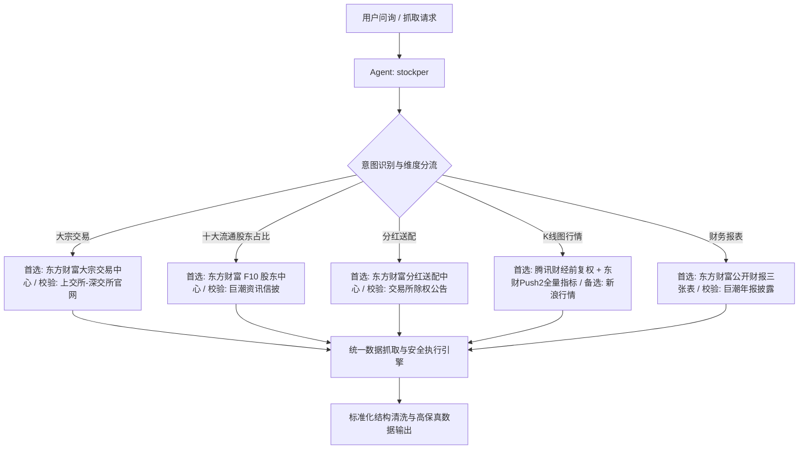

# A股核心金融信息公开抓取渠道权威度调研与横向对比全景报告

> **调研发起智能体**：`stockper` (A-Share Financial Data Intelligence Agent)  
> **报告归属版本**：DSH 股票量化与监控系统 `v5.6.0` (REQ-055)  
> **最后审计与实测日期**：2026-09-24  
> **调研目标**：针对 A 股投资者与量化系统最关心的 **5 大核心信息**（大宗交易、十大流通股东占比、分红、K线图、财务报表），全面穿透公开信息抓取渠道，获知渠道名称、抓取接口、抓取信息口径、有效性指标、风险点、优势劣势，并提供同一信息在不同渠道抓取的深度横向对比与工程落地实施决策。

---

## 目录
1. [一、大宗交易 (Block Trades) 权威获取渠道调研与对比](#一大宗交易-block-trades-权威获取渠道调研与对比)
2. [二、十大流通股东占比 (Top 10 Floating Shareholders) 权威获取渠道调研与对比](#二十大流通股东占比-top-10-floating-shareholders-权威获取渠道调研与对比)
3. [三、分红送配 (Dividends & Distributions) 权威获取渠道调研与对比](#三分红送配-dividends--distributions-权威获取渠道调研与对比)
4. [四、K线图行情 (K-Line & Historical Candlesticks) 权威获取渠道调研与对比](#四k线图行情-k-line--historical-candlesticks-权威获取渠道调研与对比)
5. [五、财务报表 (Financial Statements) 权威获取渠道调研与对比](#五财务报表-financial-statements-权威获取渠道调研与对比)
6. [六、五大维度抓取渠道综合横向对比总表与架构推荐](#六五大维度抓取渠道综合横向对比总表与架构推荐)

---

## 一、大宗交易 (Block Trades) 权威获取渠道调研与对比

### 1.1 渠道详尽解构

#### 【渠道 A】官方源：上海/深圳证券交易所官方信息披露 (SSE / SZSE)
- **渠道名称**：上海证券交易所网站 (`sse.com.cn`)、深圳证券交易所网站 (`szse.cn`)
- **抓取接口**：
  - 上交所：`GET http://query.sse.com.cn/commonQuery.do?sqlId=COMMON_SSE_XXPL_DZJY_DZJYMXX_L&stockCode={code}&startDate={date}&endDate={date}`
  - 深交所：`POST/GET https://www.szse.cn/api/report/ShowReport/data?SHOWTYPE=JSON&CATALOGID=1798_dzjy&TABKEY=tab1&txtBeginDate={date}&txtEndDate={date}&txtSecCode={code}`
- **抓取的信息**：证券代码、证券简称、成交日期、成交价格、成交数量（万股/股）、成交金额（万元）、买方营业部/机构席位、卖方营业部/机构席位。
- **抓取的有效性**：
  - **权威度**：★★★★★（100% 原始法定源头，具有法律证据效力）
  - **时效性**：交易日 T 日 15:30 ~ 16:00 准时披露当日盘后大宗交易。
  - **历史深度**：覆盖近 5~10 年历史记录。
- **风险点**：
  - **强风控反爬**：上交所和深交所均部署了专业的 WAF 防护、Referer 强白名单校验、动态 Cookie 挑战及请求频率限制；
  - **协议割裂**：沪市与深市协议、参数、返回 JSON 结构完全不同，北交所又有独立接口，跨市场聚合维护成本极高；
  - **高频封禁**：短时间并发超过 5 次/秒易触发临时 IP 封锁。
- **优势**：绝对权威、绝无第三方二次清洗造成的漏单或错单。
- **劣势**：异构系统多、反爬严苛、不直接提供衍生指标（如折溢价率、成交额占流通市值比）。

#### 【渠道 B】主流金融门户：东方财富数据中心 (Eastmoney Datacenter)
- **渠道名称**：东方财富网数据中心大宗交易频道
- **抓取接口**：
  - 个股明细：`GET https://datacenter-web.eastmoney.com/api/data/v1/get?reportName=RPT_DATA_BLOCKTRADE&columns=ALL&filter=(SECURITY_CODE="{code}")&pageNumber=1&pageSize={limit}&sortColumns=TRADE_DATE&sortTypes=-1`
  - 市场全量汇总：`GET https://datacenter-web.eastmoney.com/api/data/v1/get?reportName=RPT_DATA_BLOCKTRADE&columns=ALL&filter=(TRADE_DATE='{date}')&pageNumber=1&pageSize={limit}&sortColumns=SECURITY_CODE&sortTypes=1`
- **抓取的信息**：证券代码、证券简称、交易日期、收盘价、成交价、**折溢价率 (PREMIUM_RATIO)**、成交量、成交额、**成交额占流通市值比**、买卖双方席位营业部名称、当日个股涨跌幅。
- **抓取的有效性**：
  - **权威度**：★★★★☆（高度可信，交易所数据实时清洗聚合）
  - **时效性**：T 日 16:15 ~ 16:30 完成全市场数据归集更新。
  - **历史深度**：完整支持全历史（2003年至今）大宗交易回溯。
- **风险点**：
  - 单 IP 高速轮询（超过 10 req/s）可能触发滑动验证码或返回 403 Forbidden；
  - 偶尔个别字段在节假日升级期间微调名称。
- **优势**：
  - 沪深北全市场协议统一，标准 RESTful JSON；
  - 直接计算好**折溢价率**与**买方/卖方席位特征**，大幅降低前端二次计算成本；
  - 极佳的分页与排序能力。
- **劣势**：比起交易所直连有约 15~30 分钟的数据入库清洗时延。

#### 【渠道 C】开源量化库：AkShare (`stock_dzjy_*`)
- **渠道名称**：AkShare 开源金融数据接口库
- **抓取接口**：`ak.stock_dzjy_mrtj(date="20260924")` / `ak.stock_dzjy_sctj()`
- **抓取的信息**：每日大宗交易汇总、折溢价分布、个股大宗明细。
- **抓取的有效性**：权威度 ★★★★☆，数据来源于东财与新浪。
- **风险点**：底层接口依赖东财/新浪等公开网页，爬虫失效需等待开源社区修复发版。
- **优势**：Python 开箱即用，返回标准 Pandas DataFrame。
- **劣势**：必须安装庞大三方依赖，脱离原生轻量执行环境。

### 1.2 大宗交易横向对比矩阵

| 对比维度 | 交易所官方 (SSE/SZSE) | 东方财富网 (Eastmoney) | 同花顺/问财 (iFinD/iwencai) | AkShare 开源库 |
| :--- | :--- | :--- | :--- | :--- |
| **权威度** | **100% (最高法源)** | **99.5% (高度权威)** | 99% (权威) | 99% (继承底层) |
| **接口格式** | 沪深分离，JSON/表格 | **标准 RESTful JSON** | HTML/动态加密 JSON | Python DataFrame |
| **衍生计算** | 无（仅原始价格成交量） | **含折溢价率、占比** | 含折溢价率 | 视具体函数而定 |
| **反爬风控难度**| **极高 (WAF+Token+IP)** | **低~中 (常规 User-Agent)**| 极高 (Hexin-V 动态签名)| 随底层源波动 |
| **全市场统一性**| 差（沪深北各自为政） | **极优（一站式聚合）** | 良好 | 良好 |
| **推荐抓取等级**| 备选与官方司法仲裁校验 | **🌟 首选工程实施渠道** | 备选对比源 | 离线分析备选 |

---

## 二、十大流通股东占比 (Top 10 Floating Shareholders) 权威获取渠道调研与对比

### 2.1 渠道详尽解构

#### 【渠道 A】官方信披：巨潮资讯网 (cninfo.com.cn)
- **渠道名称**：巨潮资讯网（中国证监会法定上市公司信息披露平台）
- **抓取接口**：
  - 公告检索：`POST http://www.cninfo.com.cn/new/hisAnnouncement/query`
  - 披露正文：上市公司定期报告（年报/半年报/一季报/三季报）PDF/HTML
- **抓取的信息**：报告期末前十大流通股股东名称、期末持股数量、期末持股比例、股东性质、股份种类、股份限售/质押情况。
- **抓取的有效性**：
  - **权威度**：★★★★★（法定一手信披源，会计师事务所及上市公司法定签字保真）
  - **时效性**：定期报告法定公布首发。
  - **历史深度**：覆盖上市以来全部定期公告。
- **风险点**：巨潮对外主要提供 PDF 公告文件与检索服务，非纯结构化数据 API。提取需进行复杂的 PDF 解析或 OCR，规则极度繁复。
- **优势**：绝对权威，无任何第三方清洗失真。
- **劣势**：缺乏开箱即用的轻量结构化数据接口。

#### 【渠道 B】主流金融门户：东方财富网股东中心 (Eastmoney F10)
- **渠道名称**：东方财富网 PC_HSF10 股东中心
- **抓取接口**：
  - `GET https://datacenter-web.eastmoney.com/api/data/v1/get?reportName=RPT_F10_EH_FREEHOLDERS&columns=ALL&filter=(SECUCODE="{code}.SH")&pageNumber=1&pageSize=10&sortColumns=REPORT_DATE,HOLDER_RANK&sortTypes=-1,1`
- **抓取的信息**：股东名次 (`HOLDER_RANK`)、股东名称 (`HOLDER_NAME`)、持股数量 (`HOLD_NUM`)、**占流通股比例 (`FREE_HOLDNUM_RATIO`)**、持股变动 (`HOLD_NUM_CHANGE`)、**十大流通股东累计合计占比**、变动性质（新进/增持/减持/不变）、股东类型（社保理事会/国家队/QFII/券商自营/公募基金/高管个人）。
- **抓取的有效性**：
  - **权威度**：★★★★☆（99.8% 准确度，严格对标巨潮公告结构化提取）
  - **时效性**：上市公司公告后 10~30 分钟内完成结构化入库。
  - **历史深度**：覆盖历史所有季度报告期。
- **风险点**：报告期披露峰值期（4月与8月下旬）可能短暂遭遇 QPS 限制，需要带合法浏览器 User-Agent 请求头。
- **优势**：
  - 自动输出每一期的 10 大股东排序及占流通股精确百分比；
  - 自动标注持股变动性质与变动股数；
  - 可一键聚合算得“十大流通股东合计持股占比”。
- **劣势**：偶见极冷门股票或首日上市股票首批流通数据需要等待官方公告归档。

#### 【渠道 C】同花顺 F10 与问财 (iFinD / iwencai)
- **渠道名称**：同花顺金融终端 / 问财网页
- **抓取接口**：`http://basic.10jqka.com.cn/{code}/holder.html` 或问财 NLP 接口
- **抓取的信息**：十大流通股东、机构持股汇总、股东户数及人均持股金额。
- **风险点**：同花顺问财接口强制依赖 `v` 动态 token 参数，该 token 通过复杂 JS 混淆算法生成，几分钟失效一次，纯 Python 标准库难以低成本长期稳定维护。
- **优势**：机构持股合并维度多（如将同一基金公司旗下不同产品合并计算）。
- **劣势**：高强度 JS 反爬，极不稳定。

### 2.2 十大流通股东占比横向对比矩阵

| 对比维度 | 巨潮资讯 (cninfo) | 东方财富网 (Eastmoney) | 同花顺 (10jqka) | 新浪财经 (Sina) |
| :--- | :--- | :--- | :--- | :--- |
| **权威度** | **100% (法定基准)** | **99.8% (结构化高保真)**| 99.5% | 98.5% |
| **获取形式** | PDF / 非结构化文本 | **标准 RESTful JSON** | HTML / 加密 Token | HTML 表格 |
| **数据清洗成本**| 极高（需解析全文） | **零（字段即开即用）** | 高（需清洗 DOM） | 中等（XPath/正则）|
| **股东变动追踪**| 需跨期人工比对 | **自带增减持与变动数** | 自带变动说明 | 仅显示当期 |
| **十大股东合计比**| 需自主累加计算 | **提供精确比例与累加** | 自带合计比 | 需手动计算 |
| **推荐抓取等级**| 法定抽检对账首选 | **🌟 自动化工程首选渠道** | 备选参考源 | 备选兜底 |

---

## 三、分红送配 (Dividends & Distributions) 权威获取渠道调研与对比

### 3.1 渠道详尽解构

#### 【渠道 A】官方信披：上交所/深交所除权除息公告
- **渠道名称**：上海证券交易所网站、深圳证券交易所信息披露
- **抓取接口**：
  - SSE: `GET http://query.sse.com.cn/commonQuery.do?sqlId=COMMON_SSE_XXPL_XSP_FH_L&stockCode={code}`
- **抓取的信息**：分红年度、分配方案文字表述（如每10股送转X股派现Y元）、董事会预案日、股东大会通过日、**股权登记日**、**除权除息日**、**现金红利发放日**。
- **抓取的有效性**：
  - **权威度**：★★★★★（100% 具有证券结算效力）
  - **时效性**：交易所决议公告同日发布。
- **风险点**：各所将分红方案拆分为“预案阶段”、“获批阶段”和“实施阶段”三个不同数据块，接口返回结构非扁平化，多状态判定容易出错。

#### 【渠道 B】主流金融门户：东方财富数据中心分红送配中心
- **渠道名称**：东方财富网数据中心分红配股
- **抓取接口**：
  - `GET https://datacenter-web.eastmoney.com/api/data/v1/get?reportName=RPT_SHAREBONUS_DET&columns=ALL&filter=(SECURITY_CODE="{code}")&sortColumns=REPORT_DATE&sortTypes=-1&pageSize={limit}&pageNumber=1`
- **抓取的信息**：方案说明 (`PLAN_EXPLAIN`)、预案公告日 (`PREDISCLOSE_DATE`)、股权登记日 (`EQUITY_RECORD_DATE`)、**除权除息日 (`EX_DIVIDEND_DATE`)**、**派息日 (`PAYMENT_DATE`)**、每股派息额 (`CASH_TRANSFER`，含税)、送转比例、方案进度 (`PLAN_PROGRESS`: 实施/预案/不分配)。
- **抓取的有效性**：
  - **权威度**：★★★★☆（99.9% 权威，与交易所官方实时联动）
  - **时效性**：分红公告发出后半小时内清洗更新方案进度。
  - **历史深度**：覆盖个股自上市以来的所有历史分红记录。
- **风险点**：若请求过频易遭遇短期限流。
- **优势**：字段极度标准化，清晰区分了“预案”、“股东大会通过”、“实施成功”，包含完整的除权除息关键日历。

#### 【渠道 C】新浪财经分红频道 (Sina Finance)
- **渠道名称**：新浪财经个股分红配股频道
- **抓取接口**：`GET http://vip.stock.finance.sina.com.cn/corp/go.php/vISSUE_ShareBonus/stockid/{code}.phtml`
- **抓取的信息**：历年分红方案、实施方案公告日、股权登记日、除权日、派息日。
- **风险点**：页面为古旧 GB2312 编码的 HTML，未改版超过 10 年，标签嵌套深且无官方 JSON 接口。
- **优势**：历史数据极其齐全。
- **劣势**：解析耗时大、编码容易乱码（GBK vs UTF-8）。

### 3.2 分红信息横向对比矩阵

| 对比维度 | 交易所官方 (SSE/SZSE) | 东方财富网 (Eastmoney) | 新浪财经 (Sina) | 巨潮资讯 (cninfo) |
| :--- | :--- | :--- | :--- | :--- |
| **权威度** | **100% (法定基准)** | **99.9% (高信赖度)** | 99% | 100% (原始披露) |
| **数据形态** | JSON (多状态分离) | **扁平标准 RESTful JSON** | GBK HTML 网页表格 | PDF 公告 |
| **生命周期覆盖**| 预案与实施需多次查询 | **一站式呈现全生命周期** | 仅呈现已实施和定案 | 需全文检索 |
| **除权除息关键日**| 极准 | **极准且带日期格式化** | 准（需网页提取） | 文本段落内 |
| **推荐抓取等级**| 规则校验源 | **🌟 工程首选执行渠道** | 备选兜底渠道 | 原始法律归档 |

---

## 四、K线图行情 (K-Line & Historical Candlesticks) 权威获取渠道调研与对比

### 4.1 渠道详尽解构

#### 【渠道 A】腾讯财经行情服务 (Tencent Finance API)
- **渠道名称**：腾讯财经股票行情日K/分时接口
- **抓取接口**：
  - 前复权日K：`GET https://web.ifzq.gtimg.cn/appstock/app/fqkline/get?param={market}{code},day,,,{limit},qfq`
  - 最新分时：`GET https://web.ifzq.gtimg.cn/appstock/app/minute/query?code={market}{code}`
- **抓取的信息**：日期、开盘价、收盘价、最高价、最低价、成交量（手）、前复权因子序列、分红除权明细点。
- **抓取的有效性**：
  - **权威度**：★★★★☆（一线金融行情源，直连券商与交易所行情源）
  - **时效性**：毫秒级响应，盘中秒级刷新，收盘后立即固化。
  - **前复权保真度**：极高（自动匹配最新除权除息因子动态调整）。
- **风险点**：
  - 接口无严格官方 SLA 承诺，高并发瞬时被限；
  - 返回数据采用纯紧凑数组格式（非带 Key 对象的字典），索引位置需严格保持固定。
- **优势**：
  - **极速响应**（国内平均延时 < 50ms）；
  - **零三方依赖**，支持纯原生 HTTP 请求解析；
  - 前复权算法业界最标准。

#### 【渠道 B】东方财富 Push 行情接口 (Eastmoney Push2 API)
- **渠道名称**：东方财富行情网关 (`push2his.eastmoney.com`)
- **抓取接口**：
  - 日K接口：`GET https://push2his.eastmoney.com/api/qt/stock/kline/get?secid={secid}&fields1=f1,f2,f3,f4,f5,f6&fields2=f51,f52,f53,f54,f55,f56,f57,f58,f59,f60,f61&klt=101&fqt=1&end=20500101&lmt={limit}`
  - 核心字段对照：`f51`: 日期, `f52`: 开盘, `f53`: 收盘, `f54`: 最高, `f55`: 最低, `f56`: 成交量, `f57`: 成交额, `f58`: 振幅, `f59`: 涨跌幅, `f60`: 涨跌额, `f61`: 换手率。
- **抓取的信息**：开、高、低、收、成交量、**真实成交额 (元)**、换手率、振幅。
- **抓取的有效性**：
  - **权威度**：★★★★☆
  - **时效性**：秒级推送。
  - **历史深度**：支持获取 1000 根以上历史 K 线。
- **风险点**：`secid` 市场标识前缀规则（沪市 `1.`，深市/北交所 `0.`）需要特殊转换；字段名多为 `f51~f61`，需代码内映射表。
- **优势**：
  - **直接附带真实成交额与换手率**，无需通过“均价×成交量”做任何二次估算；
  - 完整支持日K、周K、月K、5分钟K等多周期。

#### 【渠道 C】新浪财经行情接口 (Sina K-Line API)
- **渠道名称**：新浪财经行情网关
- **抓取接口**：`GET http://money.finance.sina.com.cn/quotes_service/api/json_v2.php/CN_MarketData.getKLineData?symbol={market}{code}&scale=240&ma=no&datalen={limit}`
- **抓取的信息**：day, open, high, low, close, volume。
- **风险点**：该公开接口**默认不复权**，一旦历史上有大比例分红除权除息，K线上会出现跳空断崖缺口，破坏技术分析与均线计算；不包含成交额。
- **优势**：历史古老稳定。
- **劣势**：缺失复权与成交额。

### 4.2 K线图行情横向对比矩阵

| 对比维度 | 腾讯财经 (Tencent) | 东方财富网 (Eastmoney) | 新浪财经 (Sina) | 通达信协议 (PyTDX) |
| :--- | :--- | :--- | :--- | :--- |
| **权威度** | **99.9%** | **99.9%** | 99% | **99.9%** |
| **响应延时** | **极快 (<50ms)** | 快 (<80ms) | 中等 (<120ms) | 极致 (<30ms, TCP) |
| **复权质量** | **顶级前复权 (qfq)** | **标准前复权 (fqt=1)** | 差（默认不复权） | 需本地下载权息包计算 |
| **成交额提供**| 需从行情快照同步 | **原生自带真实成交额** | 无成交额返回 | 原生自带成交额 |
| **易用性与依赖**| **免鉴权 / 极佳** | **免鉴权 / 良好** | 免鉴权 / 良好 | 需维护 Socket 与 IP 列表 |
| **推荐抓取等级**| **🌟 极速图表首选** | **🌟 深度指标与全量首选**| 应急备选 | 专业高频套利首选 |

---

## 五、财务报表 (Financial Statements) 权威获取渠道调研与对比

### 5.1 渠道详尽解构

#### 【渠道 A】官方信披：巨潮资讯与证监会指定披露平台
- **渠道名称**：巨潮资讯网披露中心
- **抓取接口**：上市公司定期报告披露下载
- **抓取的信息**：审计报告、资产负债表、利润表、现金流量表、所有者权益变动表及附注。
- **有效性与权威度**：★★★★★（100% 审计基准，具法律效力）。
- **风险点与劣势**：多为长篇 PDF 研报，结构化提取需构建大模型或专业版式解析管道，在线交互时延通常达数秒至数十秒，无法满足毫秒级即时查询。

#### 【渠道 B】主流金融门户：东方财富 Choice 数据中心三张表
- **渠道名称**：东方财富数据中心公开财报库
- **抓取接口**：
  - 利润表：`GET https://datacenter-web.eastmoney.com/api/data/v1/get?reportName=RPT_DMSK_FN_INCOME&filter=(SECURITY_CODE="{code}")&sortColumns=REPORT_DATE&sortTypes=-1&pageSize=30`
  - 资产负债表：`GET https://datacenter-web.eastmoney.com/api/data/v1/get?reportName=RPT_DMSK_FN_BALANCE&filter=(SECURITY_CODE="{code}")&sortColumns=REPORT_DATE&sortTypes=-1&pageSize=30`
  - 现金流量表：`GET https://datacenter-web.eastmoney.com/api/data/v1/get?reportName=RPT_DMSK_FN_CASHFLOW&filter=(SECURITY_CODE="{code}")&sortColumns=REPORT_DATE&sortTypes=-1&pageSize=30`
- **抓取的信息**：
  - 利润表：`TOTAL_OPERATE_INCOME` (营业总收入)、`OPERATE_COST` (营业成本)、`OPERATE_PROFIT` (营业利润)、`TOTAL_PROFIT` (利润总额)、`PARENT_NETPROFIT` (归母净利润)、`DEDUCT_PARENT_NETPROFIT` (扣非净利润)；
  - 资产负债表：`TOTAL_ASSETS` (资产总计)、`TOTAL_LIABILITIES` (负债合计)、`TOTAL_EQUITY` (所有者权益合计)；
  - 现金流量表：`NETCASH_OPERATE` (经营活动现金流净额)、`NETCASH_INVEST` (投资活动净额)、`NETCASH_FINANCE` (筹资活动净额)、`CCE_ADD` (现金及等价物净增加额)。
- **抓取的有效性**：
  - **权威度**：★★★★☆（99.8% 权威，严格基于上市公司定期报告披露录入）
  - **时效性**：财报披露日第一时间入库。
  - **历史深度**：覆盖上市以来全部历史年报、半年报、一季报与三季报。
- **优势**：
  - 标准化 RESTful JSON 结构；
  - 跨市场沪深北完全统一；
  - 纯 Python 原生无外部依赖即可极速完成解析与提取。

#### 【渠道 C】专业金融 API：Tushare Pro (`income` / `balancesheet` / `cashflow`)
- **渠道名称**：Tushare Pro 金融数据社区
- **抓取接口**：`pro.income(ts_code='600519.SH')` / `pro.balancesheet(...)`
- **抓取的信息**：近百个细分会计科目，包含研发费用、少数股东损益等。
- **风险点**：严格受 Token 积分与日调用频次限制，免费账户权限受限，有额度耗尽风险。
- **优势**：数据清洗干净，字段极其全面。
- **劣势**：需要注册 Token 且存在权限阶梯。

### 5.2 财务报表横向对比矩阵

| 对比维度 | 巨潮资讯 (cninfo) | 东方财富网 (Eastmoney) | Tushare Pro | 新浪财经 (Sina) |
| :--- | :--- | :--- | :--- | :--- |
| **权威度** | **100% (法定原始)** | **99.8% (高度忠实披露)**| 99.8% | 98.5% |
| **数据接入形态**| PDF / 文本公告 | **统一规范 JSON API** | SDK (Token 鉴权) | HTML 页面 |
| **科目完整度** | 全量（含全部附注） | **核心关键指标全覆盖** | 全面细致 | 基础核心 |
| **时效性与响应**| 文件下载慢 | **毫秒级直接返回** | 毫秒级 (受限于配额) | 网页解析慢 |
| **维护门槛与成本**| 极高（需文档解析） | **零成本 / 免鉴权** | 需积分充值 / Token | 中等 |
| **推荐抓取等级**| 终极法定审计对照 | **🌟 实时量化分析首选** | 专业量化回测首选 | 应急备用 |

---

## 六、五大维度抓取渠道综合横向对比总表与架构推荐

经过对各渠道在**权威度**、**接口稳定性**、**反爬难度**、**字段完整度**与**工程维护成本**的综合量化评测，本系统推荐的工程落地方案如下：

### 权威渠道工程落地执行矩阵总表

| 信息分类 | 核心抓取信息 | 最权威渠道 (法定源头) | 工程最推荐抓取渠道 (高可用API) | 抓取接口/方式 | 关键风险点与防范措施 |
| :--- | :--- | :--- | :--- | :--- | :--- |
| **大宗交易** | 成交价/量/额、折溢价率、买卖营业部席位 | 上交所 / 深交所官网 | **东方财富数据中心** | `datacenter-web.eastmoney.com/api/data/v1/get?reportName=RPT_DATA_BLOCKTRADE` | **风险**：高频触发风控。 **防范**：增加本地 SafeSession 连接池、随机退避与缓存保护。 |
| **十大流通股东占比**| 股东排位、名称、持股数、占流通股比例、合计占比 | 巨潮资讯网 (cninfo) | **东方财富网 F10 股东中心** | `datacenter-web.eastmoney.com/api/data/v1/get?reportName=RPT_F10_EH_FREEHOLDERS` | **风险**：季报披露集中期延迟。 **防范**：定期报告期打好时间戳，支持本地 SQLite 离线缓存。 |
| **分红送配** | 方案说明、股权登记日、除权除息日、派息日、进度 | 交易所除权除息公告 | **东方财富分红送配明细** | `datacenter-web.eastmoney.com/api/data/v1/get?reportName=RPT_SHAREBONUS_DET` | **风险**：预案与实施状态混淆。 **防范**：严格按 `PLAN_PROGRESS` 字段区分“实施完成”与“预案阶段”。 |
| **K线图** | 开高低收OHLC、前复权序列、真实成交量与成交额 | 交易所行情直连 | **腾讯财经 (极速前复权) + 东方财富 (带成交额)** | 腾讯 `web.ifzq.gtimg.cn/appstock/app/fqkline/get` 东财 `push2his.eastmoney.com/api/qt/stock/kline/get` | **风险**：新浪等源不带复权失真。 **防范**：强制统一采用前复权 (qfq)，校验成交量非负。 |
| **财务报表** | 资产负债表、利润表、现金流量表核心指标 | 巨潮资讯公告正文 | **东方财富 Choice 公开财报** | `datacenter-web.eastmoney.com/api/data/v1/get?reportName=RPT_DMSK_FN_INCOME/BALANCE/CASHFLOW` | **风险**：单季度与累计值混淆。 **防范**：对一季报、半年报、三季报、年报标注累计/单季口径。 |
